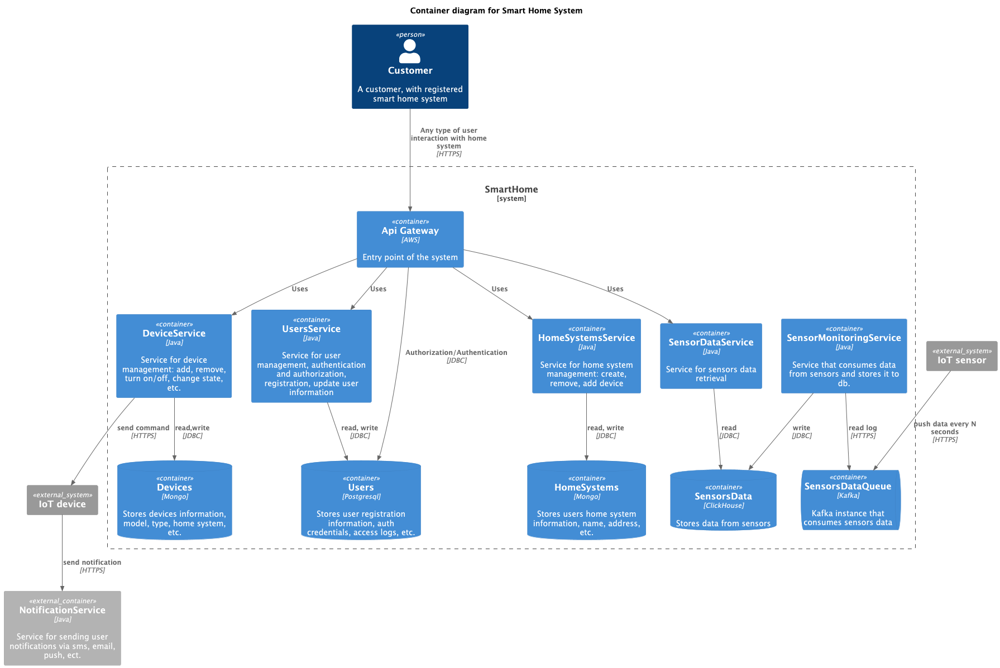
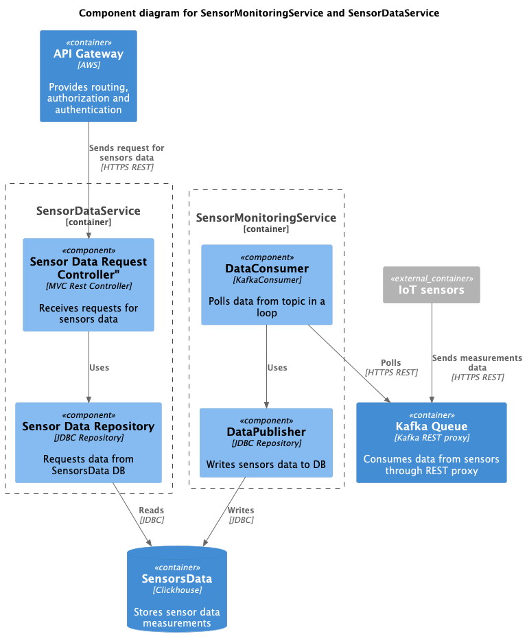
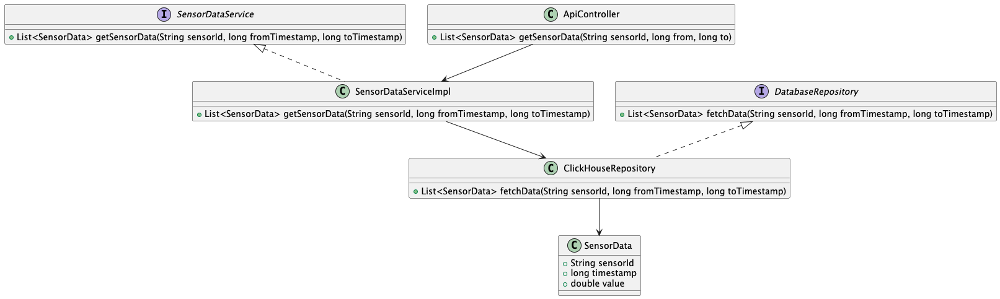
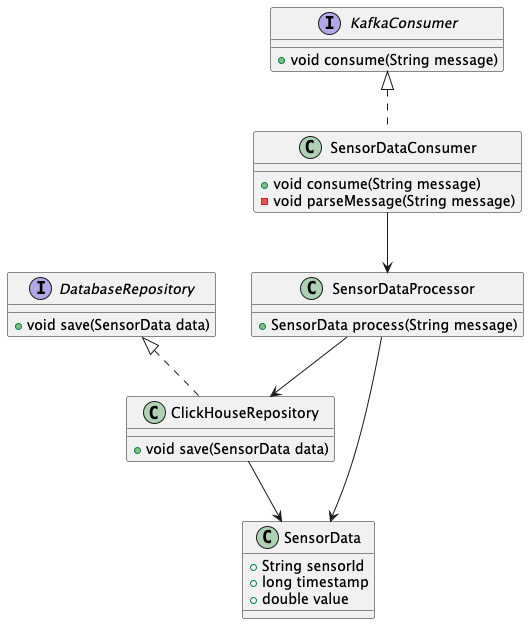
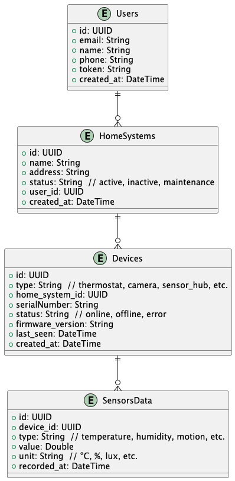

Это шаблон для решения **первой части** проектной работы. Структура этого файла повторяет структуру заданий. Заполняйте его по мере работы над решением.

# Задание 1. Анализ и планирование

Чтобы составить документ с описанием текущей архитектуры приложения, можно часть информации взять из описания компании условия задания. Это нормально.

### 1. Описание функциональности монолитного приложения

**Управление отоплением:**

- Пользователи могут обновлять информацию о системе отопления
- Включать систему отопления
- Выключать систему отопления
- Получать состояние системы отопления

**Мониторинг температуры:**

- Пользователи могут задать желаемую температуру
- Пользователи могу получить текущую температуру
- …

### 2. Анализ архитектуры монолитного приложения

- Язык программирования: Java
- База данных: PostgreSQL
- Архитектура: Монолитная, все компоненты системы (обработка запросов, бизнес-логика, работа с данными) находятся в рамках одного приложения.
- Взаимодействие: Синхронное, запросы обрабатываются последовательно.
- Масштабируемость: Ограничена, так как монолит сложно масштабировать по частям.
- Развёртывание: Требует остановки всего приложения.

### 3. Определение доменов и границы контекстов
Согласно целям бизнеса будут добавлены следующие домены и контексты:
- Домен: *Управление устройствами*
    - контекст: Подключение устройства
    - контекст: Управление состоянием устройств
- Домен: *Управление пользователями*
  - контекст: Регистрация пользователей
  - контекст: Авторизация и аутентификация пользователей
- Домен: *Мониторинг устройств*
  - контекст: Обработка показателей датчиков

### **4. Проблемы монолитного решения**
В текущем состоянии монолитная система хорошо справляется с задачами, но ей не хватает гибкости и значительной части функционала.
Нет управления пользователями, аутентификации и авторизации — злоумышленник, завладевший ID устройства, может легко получить доступ к управлению системой отопления.
Информация с датчиков запрашивается напрямую с устройства по сети, что может ухудшить пользовательский опыт при проблемах с подключением в доме.

Как видно, большинство проблем связаны не с архитектурой системы, а с реализацией текущих функций.
В данной ситуации целесообразно сохранить монолитную архитектуру, учитывая размер команды разработчиков (5 человек) и количество клиентов (100).
Даже при подключении нескольких поселков число клиентов будет измеряться тысячами, что не создаст значительной нагрузки на систему.

Так как поселки могут находиться в разных регионах страны, можно развернуть несколько инстансов монолитного приложения в различных зонах, чтобы повысить скорость отклика системы.
Управление системой умного дома подразумевает нахождение пользователя в том же регионе.

С учетом всего вышеперечисленного разумнее сосредоточиться на внедрении нового функционала, чем на переходе к сложной микросервисной архитектуре при ограниченных ресурсах команды.
Для повышения гибкости архитектуры можно разделить приложение на модули в рамках доменных областей, чтобы в будущем облегчить возможный переход к микросервисной архитектуре.

### 5. Визуализация контекста системы — диаграмма С4

# Задание 2. Проектирование микросервисной архитектуры
**Диаграмма контейнеров (Containers)**

**Диаграмма компонентов (Components)**

**Диаграмма кода (Code)**

Диаграмма классов для SensorDataService

Диаграмма классов для SensorMonitoringService

# Задание 3. Разработка ER-диаграммы

***Описание связей в ER диаграмме***
- Users -> HomeSystems
  Связь: Один-ко-многим (1:N)
  Один пользователь может владеть несколькими системами умного дома.
  Каждая система умного дома привязана к одному конкретному пользователю.
  В базе данных HomeSystems есть ключ user_id, ссылающийся на базу данных Users.
- HomeSystems -> Devices
  Связь: Один-ко-многим (1:N)
  Каждая система умного дома может содержать несколько устройств.
  Каждое устройство принадлежит только одной системе умного дома.
  Реализация: В базе данных Devices есть внешний ключ home_system_id, ссылающийся на HomeSystems. 
- Devices -> SensorsData
  Связь: Один-ко-многим (1:N)
  Каждое устройство может генерировать множество записей данных. 
  Одна запись данных привязана к конкретному устройству.
  Реализация: В таблице SensorsData есть внешний ключ device_id, ссылающийся на Devices.

User не связан напрямую с Device или SensorData, но через HomeSystem он управляет всеми устройствами и их данными.
Device может представлять как управляющее устройство, так и концентратор для сенсоров.
SensorData содержит данные измерений (температура, влажность и т. д.)
Эта структура хорошо масштабируется, что позволит легко добавлять новые типы устройств, сценарии управления и измерения данных. 
